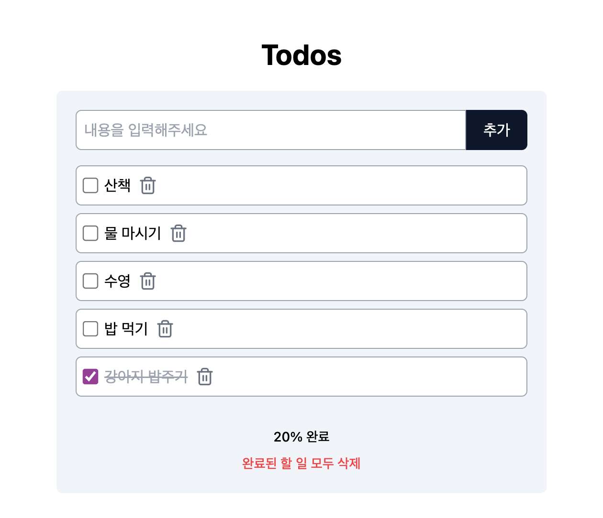

# Todos App (React + TypeScript + Tailwind CSS)

이 프로젝트는 간단한 Todo 리스트 애플리케이션입니다. 사용자는 할 일을 추가/삭제하고, 완료 상태를 변경하고, 완료된 할 일의 달성도를 확인할 수 있습니다.

- [DEMO](https://fromnowwon.github.io/react-ts-tw-todo-app/)



## 기능

- 할 일 추가 및 삭제
- 할 일 완료 상태 변경
- 완료된 할 일과 전체 할 일의 비율 표시
- 할 일 정렬: 완료 여부와 ID 기준

## 설치 및 실행 방법

1. 저장소를 클론합니다.

```bash
git clone https://github.com/fromnowwon/react-ts-tw-todo-app
```

2. 프로젝트 폴더로 이동합니다.

```bash
cd react-ts-tw-todo-app
```

3. 필요한 패키지를 설치합니다.

```bash
npm install
```

4. 개발 서버를 실행합니다.

```bash
npm run dev
```

5. 웹 브라우저에서 `http://localhost:3000`을 엽니다.

## 사용 기술

- React.js
- TypeScript
- Tailwind CSS

## 폴더 및 파일 구조

```plaintext
├── src/
│   ├── assets/
│   ├── components/
│   │   ├── AddTodoForm.jsx
│   │   ├── TodoItem.css
│   │   ├── TodoList.jsx
│   │   ├── TodoResult.css
│   ├── hooks/
│   ├── types/
│   ├── App.js
│   ├── index.js
│   ├── index.css
├── package.json
├── README.md
└── ...
```

- **src/**: 소스 코드가 포함된 디렉토리
  - **assets/**: 이미지 및 기타 자산 파일
  - **components/**: React 컴포넌트 파일들
  - **hooks/**: 커스텀 React 훅을 저장하는 디렉토리. 상태 관리 및 로직 재사용을 위해 사용됩니다.
  - **types/**: TypeScript 타입 정의 파일을 저장하는 디렉토리. 프로젝트에서 사용하는 타입들을 정의합니다.
- **App.js**: 주 애플리케이션 컴포넌트

## 저자

- [Chaewon Jeong](https://github.com/fromnowwon)

## 라이센스

이 프로젝트는 MIT 라이센스 하에 배포됩니다. 자세한 내용은 LICENSE 파일을 참조하세요.

```

위 README.md 예시는 프로젝트의 구조, 설치 및 실행 방법, 주요 기능, 기여 방법, 저자 정보, 라이센스 등을 포함하고 있습니다. 프로젝트의 특성에 맞게 세부적으로 수정하여 사용하시면 됩니다.
```
